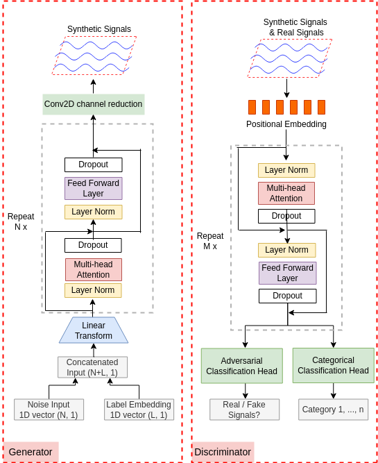

# TTS-CGAN: A Transformer Time-Series Conditional GAN for Biosignal Data Augmentation
---

This repository contains code from the paper "TTS-CGAN: A Transformer Time-Series Conditional GAN for Biosignal Data Augmentation".

---

**Abstract:**
Signal measurement appearing in the form of time series is one of the most common types of data used in pervasive computing applications. Such datasets are often small in size, expensive to collect and annotate, and might involve privacy issues, which hinder our ability to train large, state-of-the-art deep learning models. For time-series data, the suite of data augmentation strategies we can use to expand the size of the dataset is limited by the need to maintain the basic properties of the signal. Generative Adversarial Networks (GANs) can be utilized as another data augmentation tool. 
In this paper, we present TTS-CGAN, a transformer-based conditional GAN model that can be trained on existing multi-class datasets and generate class-specific synthetic time-series sequences of arbitrary length. We elaborate on the model architecture and design strategies. Synthetic sequences generated by our models are almost indistinguishable from real ones and can be used to complement or replace real signals of the same type, thus achieving the goal of data augmentation. 
To evaluate the quality of the generated data, we modify the wavelet coherence metric to compare the similarity between real and synthetic signals. Finally, qualitative visualizations using t-SNE and quantitative comparisons using the discriminative and predictive power of the synthetic data show that TTS-CGAN outperforms other state-of-the-art GAN models built for time-series data generation. 

**Major Contributions:**

Use Transformer GAN to generate multi-category synthetic time-series data.

Use Wavelet Coherence score to compare the similarity between two sets of signals.

**The TTS-CGAN Architecture** 


---
**Code structure:**

**TransCGN_model.py**: The tts-cgan model architecture. It contains the code of the transformor-based generator and discriminator. The generator has embedded labels. The discriminator has two classficatio heads, one is for adversarial classification and another one is for categorical classfication.    
**trainCGAN.py**: Contains code for model initialization, load dataset, and training process. Several intermediate results will show on the Tensorboard.

**Dataloader.py**: The PyTorch dataloader written for loading mitbih heat beat signals. Download the dataset mitbih_train.csv and mitbih_test.csv from [here](https://www.kaggle.com/code/azazurrehmanbutt/ecg-classification-using-cnn-lstm/data?scriptVersionId=74982392) and save it to your code directory. 

**synDataloader.py**: The PyTorch dataloader written for loading mitbih synthetic signals from pre-trained generator. 

**mitbih_checkpoint**: A pretrained TTS-CGAN checkpoint.

**cgan_functions.py, utils.py**: contains some helper functions. 

**adamw.py**: adamw implementation. 

**cfg.py**: the definition of parse arguments. 

**mitbit_Train_CGAN.py**: a script used for start model training. 

**classification.ipynb**: Post-hoc classficaiton examples used for generating the plots in paper Figure 10. 

**LookAtData.ipynb**: show some plots of real mitbih heartbeat signals and synthetic signals. 

**The folder Label-embedding**: contains code used for generating the plots in paper Figure 5. 


**Implementation structions:**


To re-train the model: 
```
python mitbih_Train_CGAN.py
```
Modify the parse arguments to fit for your dataset. 

---
